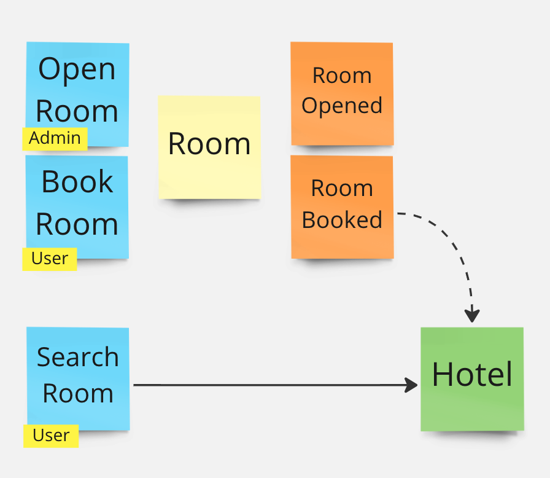
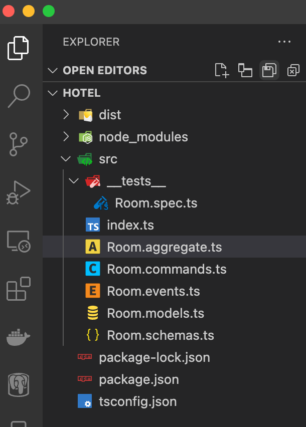
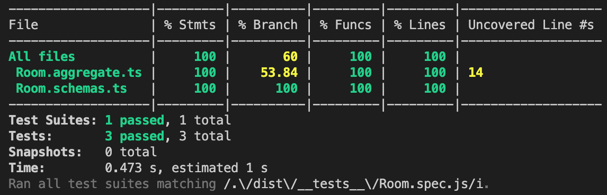

# Eventually Monorepo


[](https://coveralls.io/github/andela-technology/eventually-monorepo?branch=master)

## Writing a Hotel Reservation System

This tutorial was inspired by [https://medium.com/thedevproject/clean-architecture-a-basic-example-of-folders-organization-aab07f9eea68](https://medium.com/thedevproject/clean-architecture-a-basic-example-of-folders-organization-aab07f9eea68). Here we will show a different approach to coding the same API using [Eventually](./libs/eventually/README.md).

### **1.** Domain Model

In [Eventually](./libs/eventually/README.md) **the model** is king and code is just a side effect. All important decisions are made on the modeling surface before they get transferred to code.

> We recommend using [Event Storming](https://www.eventstormingcom/) or [Event Modeling](https://eventmodeling.org/) to clearly define what we are trying to build in lego-like business friendly terms.

In this particular API, we are modeling:

* A hotel administrator that can open rooms to reservations - via `OpenRoom` commands
* Customers that can query a `Hotel` for available rooms - via `SearchRoom` query commands
* Customers that can book available rooms - via `BookRoom` commands

The Event Storming model is super simple and captures:

* A `Room` aggregate receiving `OpenRoom`, `BookRoom` commands and emitting `RoomOpened`, `RoomBooked` events that are projected into a `Hotel` read model



### **2.** Schemas

Aggregates and Read Models have **State** that can be stored. We must think about the shape and validation guards of these schemas next...*following the original post*:

```typescript
export enum RoomType {
  SINGLE = 'single',
  DOUBLE = 'double',
  DELUXE = 'deluxe'
}

export type Reservation = {
  id: string;
  checkin: Date;
  checkout: Date;
  totalPrice: number;
}

export type Room = {
  number: number;
  type: RoomType;
  price: number;
  reservations?: Reservation[];
}

export type Hotel = Record<number, Room>;
```

Message payloads also have schemas...

```typescript
export type OpenRoom = Room;
export type RoomOpened = Room;
export type BookRoom = Reservation & { number: number };
export type RoomBooked = Reservation & { number: number };
export type SearchRoom = Pick<Reservation, "checkin" | "checkout">;
```

### **3.** Transfer Model to Code

With a model and clear schemas we are ready to code...

```bash
mkdir hotel
cd hotel
npm init # follow prompt
npx tsc --init
npm i --save joi @andela-technology/eventually @andela-technology/eventually-express
npm i --save-dev ts-node-dev jest @types/jest
```

#### *package.json*

```json
{
  "name": "hotel",
  "version": "1.0.0",
  "description": "Hotel Reservation System",
  "main": "index.js",
  "scripts": {
    "start:dev": "npx ts-node-dev --respawn ./src/index.ts",
    "test": "npx tsc && jest ./dist/**/*.spec.js"
  },
  "author": "",
  "license": "ISC",
  "dependencies": {
    "@andela-technology/eventually": "^4.2.1",
    "@andela-technology/eventually-express": "^4.1.1",
    "joi": "^17.6.3"
  },
  "devDependencies": {
    "@types/jest": "^29.1.2",
    "jest": "^29.2.0",
    "ts-node-dev": "^2.0.0"
  }
}
```

#### *tsconfig.json*

```json
{
  "compilerOptions": {
    "module": "commonjs",
    "target": "ES2021",
    "sourceMap": true,
    "declaration": true,
    "declarationMap": true,
    "noImplicitAny": true,
    "esModuleInterop": true,
    "skipLibCheck": true,
    "sourceRoot": "./src",
    "outDir": "./dist"
  },
  "include": ["src"]
}
```

Add a dummy entry point *./src/index.ts*

```typescript
import { app } from "@andela-technology/eventually";
import { ExpressApp } from "@andela-technology/eventually-express";

app(new ExpressApp()).build();
void app().listen();
```

and make sure it runs...

```bash
LOG_LEVEL="trace" npm run start:dev
```

#### Transfer model files

#### *./src/Room.models.ts*

```typescript
export enum RoomType {
  SINGLE = "single",
  DOUBLE = "double",
  DELUXE = "deluxe",
}

export type Reservation = {
  id: string;
  checkin: Date;
  checkout: Date;
  totalPrice: number;
};

export type Room = {
  number: number;
  type: RoomType;
  price: number;
  reservations?: Reservation[];
};

export type SearchRoom = Pick<Reservation, "checkin" | "checkout">;
```

#### *./src/Room.schemas.ts*

```typescript
import joi from "joi";
import * as models from "./Room.models";

export const Reservation = joi
  .object<models.Reservation>({
    id: joi.string(),
    checkin: joi.date(),
    checkout: joi.date(),
    totalPrice: joi.number(),
  })
  .options({ presence: "required" });

export const Room = joi
  .object<models.Room>({
    number: joi.number(),
    type: joi.valid(...Object.values(models.RoomType)),
    price: joi.number(),
    reservations: joi.array().optional().items(Reservation),
  })
  .options({ presence: "required" });

export const BookRoom = joi
  .object({
    number: joi.number().required(),
  })
  .concat(Reservation);

export const RoomBooked = BookRoom;

export const SearchRoom = joi
  .object<models.SearchRoom>({
    checkin: joi.date(),
    checkout: joi.date(),
  })
  .options({ presence: "required" });
```

#### *./src/Room.commands.ts*

```typescript
import { Reservation, Room } from "./Room.models";

export type RoomCommands = {
  OpenRoom: Room;
  BookRoom: Reservation & { number: number };
};
```

#### *./src/Room.events.ts*

```typescript
import { Reservation, Room } from "./Room.models";

export type RoomEvents = {
  RoomOpened: Room;
  RoomBooked: Reservation & { number: number };
};
```

#### A dummy version of *./src/Room.aggregate.ts`*

```typescript
import { Aggregate } from "@andela-technology/eventually";
import { RoomCommands } from "./Room.commands";
import { RoomEvents } from "./Room.events";
import * as schemas from "./Room.schemas";
import * as models from "./Room.models";

export const Room = (
  id: string
): Aggregate<models.Room, RoomCommands, RoomEvents> => ({
  schemas: {
    state: schemas.Room,
    OpenRoom: schemas.Room,
    BookRoom: schemas.BookRoom,
    RoomOpened: schemas.Room,
    RoomBooked: schemas.RoomBooked,
  },

  stream: () => `Room-${id}`,
  init: (): models.Room => ({
    number: +id,
    type: models.RoomType.SINGLE,
    price: 0,
  }),

  onOpenRoom: () => Promise.resolve([]),
  onBookRoom: () => Promise.resolve([]),

  applyRoomOpened: () => undefined,
  applyRoomBooked: () => undefined,
});
```

Now we can finish *./src/index.ts* by registering the new aggregate with the app builder...

```typescript
import { app, bootstrap, InMemorySnapshotStore } from "@andela-technology/eventually";
import { ExpressApp } from "@andela-technology/eventually-express";
import { Room } from "./Room.aggregate";

void bootstrap(async (): Promise<void> => {
  app(new ExpressApp())
    .withAggregate(Room, "Hotel Room", {
      store: InMemorySnapshotStore(),
      threshold: -1,
      expose: true,
    })
    .build();
  await app().listen();
});
```

Since we are using **ExpressApp**, the aggregate should be now exposed by HTTP endpoints...

```bash
LOG_LEVEL="trace" npm run start:dev
...
POST /room/:id/book-room
GET  /room/:id
GET  /room/:id/stream
GET  /all?[stream=...][&names=...][&after=-1][&limit=1][&before=...][&created_after=...][&created_before=...]
GET  /stats
```

### **4.** Write Tests First

In this case we will just implement a couple of basic tests following the original post, but these should be enough to cover most of the code we will write later...

> Always decide what you are testing before implementing the core logic (model guards/invariants and projections)

#### *./src/\_\_tests\_\_/Room.spec.ts*

```typescript
import {
  app,
  bind,
  dispose,
  InMemorySnapshotStore,
  Snapshot,
} from "@andela-technology/eventually";
import { Room } from "../Room.aggregate";
import * as models from "../Room.models";

const openRoom = (room: models.Room): Promise<Snapshot<models.Room>[]> =>
  app().command(bind("OpenRoom", room, room.number.toString()));

const bookRoom = (
  number: number,
  reservation: models.Reservation
): Promise<Snapshot<models.Room>[]> =>
  app().command(
    bind("BookRoom", { number, ...reservation }, number.toString())
  );

describe("Room", () => {
  const snapshotStore = InMemorySnapshotStore();

  beforeAll(async () => {
    app()
      .withAggregate(Room, "Hotel Room", {
        store: snapshotStore,
        threshold: -1,
      })
      .build();
    await app().listen();

    await openRoom({ number: 101, price: 100, type: models.RoomType.SINGLE });
    await openRoom({ number: 102, price: 200, type: models.RoomType.DOUBLE });
    await openRoom({ number: 103, price: 300, type: models.RoomType.DELUXE });
  });

  afterAll(async () => {
    await dispose();
  });

  it("should search rooms", async () => {
    const rooms = await snapshotStore.query({});
    expect(rooms.length).toBe(3);
  });

  it("should book room", async () => {
    const checkin = new Date();
    const checkout = new Date(checkin.getTime() + 2 * 24 * 60 * 60 * 1000);
    const room = await bookRoom(102, {
      id: "r1",
      checkin,
      checkout,
      totalPrice: 0,
    });
    expect(room[0].state?.reservations?.length).toBe(1);
    expect(room[0].state?.reservations[0].totalPrice).toBe(
      2 * room[0].state.price
    );
  });

  it("should fail booking", async () => {
    const checkin = new Date();
    const checkout = new Date(checkin.getTime() + 2 * 24 * 60 * 60 * 1000);
    await bookRoom(103, {
      id: "r2",
      checkin,
      checkout,
      totalPrice: 0,
    });
    expect(
      bookRoom(103, {
        id: "r3",
        checkin,
        checkout,
        totalPrice: 0,
      })
    ).rejects.toThrowError();
  });
});
```

Your project should look like this...



### **5.** Finish the API

At this point all tests are failing. We can now focus on closing the implementation gaps...

```typescript
import { Aggregate, bind } from "@andela-technology/eventually";
import { RoomCommands } from "./Room.commands";
import { RoomEvents } from "./Room.events";
import * as schemas from "./Room.schemas";
import * as models from "./Room.models";

const nights = (reservation: models.Reservation): number => {
  const dtime = reservation.checkout.getTime() - reservation.checkin.getTime();
  return Math.round(dtime / (1000 * 3600 * 24));
};

const isBooked = (room: models.Room, from: Date, to: Date): boolean =>
  room.reservations &&
  room.reservations.some(
    (r) =>
      (from >= r.checkin && from <= r.checkout) ||
      (to >= r.checkin && to <= r.checkout) ||
      (r.checkin >= from && r.checkin <= to) ||
      (r.checkout >= from && r.checkout <= to)
  );

export const Room = (
  id: string
): Aggregate<models.Room, RoomCommands, RoomEvents> => ({
  schemas: {
    state: schemas.Room,
    OpenRoom: schemas.Room,
    BookRoom: schemas.BookRoom,
    RoomOpened: schemas.Room,
    RoomBooked: schemas.RoomBooked,
  },

  stream: () => `Room-${id}`,
  init: (): models.Room => ({
    number: +id,
    type: models.RoomType.SINGLE,
    price: 0,
  }),

  onOpenRoom: async (data, state) => [bind("RoomOpened", data)],
  onBookRoom: async (data, state) => {
    if (isBooked(state, data.checkin, data.checkout))
      throw Error(`Room ${state.number} is booked.`);
    return [bind("RoomBooked", data)];
  },

  applyRoomOpened: (state, event) => event.data,
  applyRoomBooked: (state, event) => ({
    ...state,
    reservations: (state?.reservations || []).concat({
      ...event.data,
      totalPrice: nights(event.data) * state.price,
    }),
  }),
});
```

At this point all unit tests should pass with excellent coverage...



### Finish Hotel Projection - TODO

In this first pass we are using a snapshot store to represent the `Hotel` projection with limited querying capabilities. Future versions of the framework will develop these capabilities and probably provide an app builder interface to define read model projections and queries.

### Testing the API

You can use any of the following HTTP test clients to validate the API:

* REST Client VSCode extension
* Thunder Client VSCode extension
* Postman

Here is a sample REST Client file:

#### *./http/Room.http*

```bash
@host = http://localhost:3000

### Try to open room 101 with invalid command
POST {{host}}/room/101/open-room
Content-Type: application/json

{
  "number": "101"
}

### Open room 101
POST {{host}}/room/101/open-room
Content-Type: application/json

{
  "number": "101",
  "price": 100,
  "type": "single"
}

### Try to open room 102 with invalid type
POST {{host}}/room/102/open-room
Content-Type: application/json

{
  "number": "102",
  "price": 200,
  "type": "invalid"
}

### Open room 102
POST {{host}}/room/102/open-room
Content-Type: application/json

{
  "number": "102",
  "price": 200,
  "type": "double"
}

### Book room 101
POST {{host}}/room/101/book-room
Content-Type: application/json

{
  "id": "booking-1",
  "number": "101",
  "checkin": "2022-12-01",
  "checkout": "2022-12-03",
  "totalPrice": 0
}

### Try to book room 101 again
POST {{host}}/room/101/book-room
Content-Type: application/json

{
  "id": "booking-1",
  "number": "101",
  "checkin": "2022-12-01",
  "checkout": "2022-12-03",
  "totalPrice": 0
}

### Get Room 101
GET {{host}}/room/101

### Get Room 101 stream
GET {{host}}/room/101/stream

### Get Rooms
GET {{host}}/room

### Get API stats
GET {{host}}/stats
```
