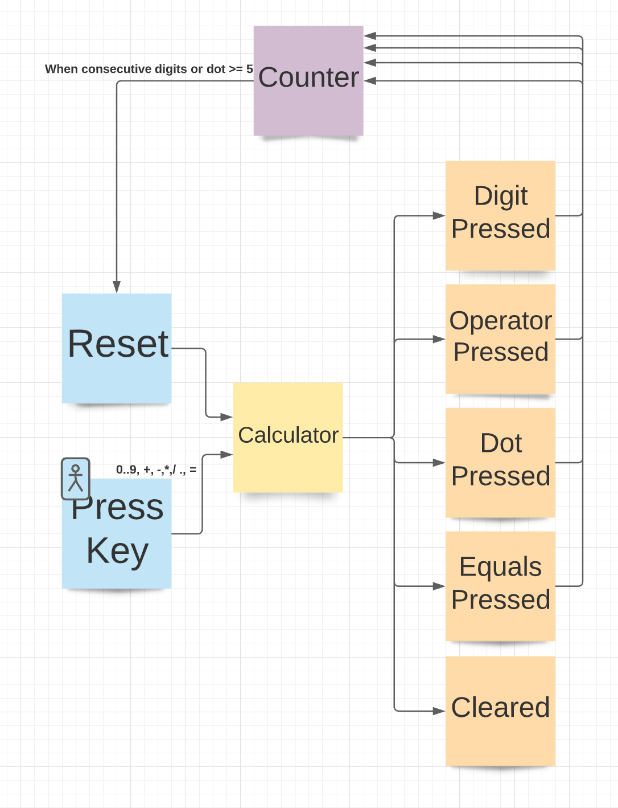
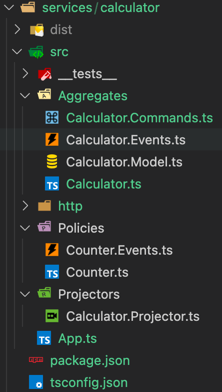
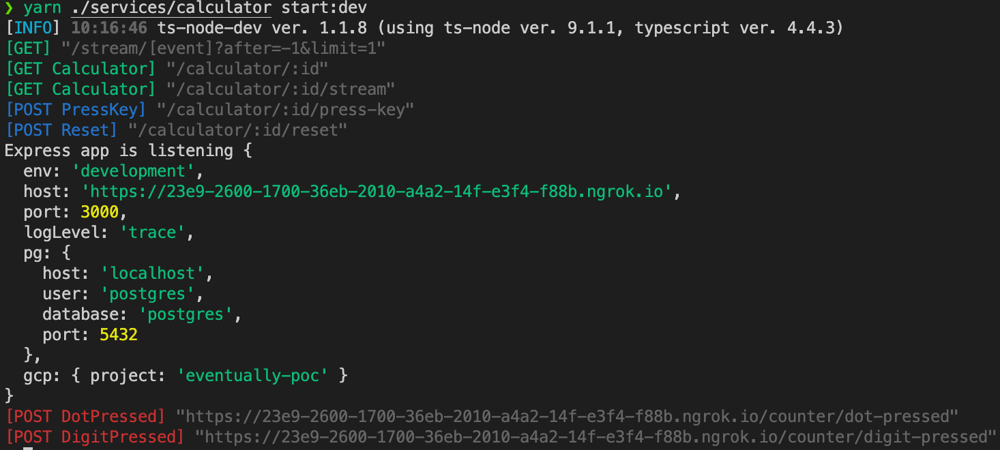
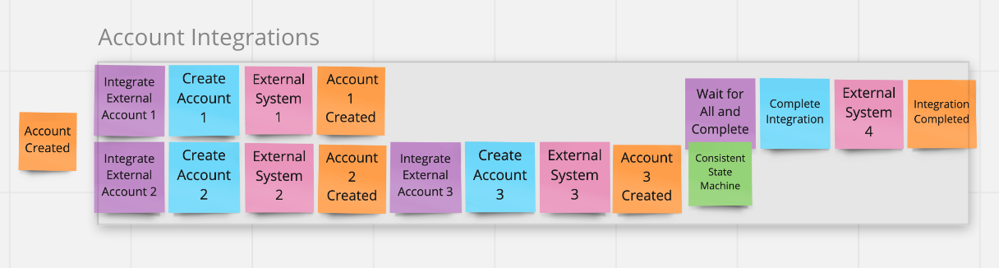
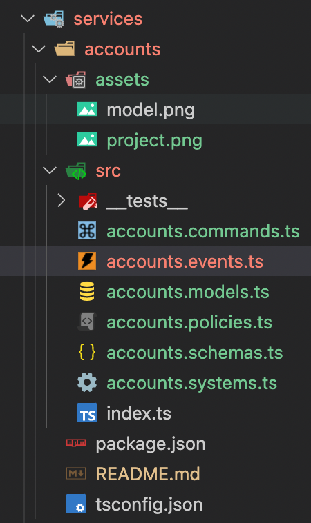

# Eventually Monorepo


[](https://coveralls.io/github/Rotorsoft/eventually-monorepo?branch=master)

Reactive TypeScript Micro-Service Framework

- Yarn 2 monorepo with workspaces and TS project references
- `/libs` - with frameworks and shared libraries
- `/services` - with micro services

A `/services/calculator` sample service is provided as a template. We recommend using a similar project structure for consistency.

Our recipe starts from an Event Storming Model. First, aggregate models, messages, and validation schemas, then aggregates and policies.

Follow TDD practices and aim for 100% code coverage.

```bash
./src
  /__mocks__
  /__tests__
    service.spec.ts
  service.aggregates.ts
  service.commands.ts
  service.events.ts
  service.models.ts
  service.policies.ts
  service.schemas.ts
  index.ts
```

The pictures below show the event storming model of the calculator service and how we transfer this model into a standard project structure:





## Setup

Full installation and configuration details can be found [here](https://yarnpkg.com/getting-started)

### Installing Yarn

```bash
> npm install -g yarn
> cd ~/path/to/project
> yarn set version berry
```

### Using Yarn

```bash
> yarn --version
> yarn help

# starting a new project
> cd ~/path/to/project
> yarn init -2

# adding dependencies
> yarn add [package]
> yarn add [package]@[version]
> yarn add [package]@[tag]

# adding dev and peer dependencies
> yarn add [package] --dev
> yarn add [package] --peer

# upgrading dependencies
> yarn up [package]
> yarn up [package]@[version]
> yarn up [package]@[tag]

# removing dependencies
> yarn remove [package]

# upgrading yarn
> yarn set version latest
> yarn set version from sources

# installing all dependencies
> yarn
> yarn install
```

### Updating `.gitignore`

```bash
# Yarn 2
.yarn/*
!.yarn/cache
!.yarn/patches
!.yarn/plugins
!.yarn/releases
!.yarn/sdks
!.yarn/versions
```

### Updating `.gitattributes`

```bash
/.yarn/releases/** binary
/.yarn/plugins/** binary
```

### Configuring TypeScript with VSCode Integration

```bash
> yarn add --dev typescript
> yarn dlx @yarnpkg/sdks vscode

# to manage @types automatically
> yarn plugin import typescript

# to bump versions with yarn version
> yarn plugin import version

# to start new package in monorepo
> yarn ./path/to/package init

# to run commands inside package
> yarn ./path/to/package [command]
```

- Press `ctrl-shift-p` in a TS file
- Choose "Select TypeScript Version"
- Pick "Use Workspace Version"

### Using PnP mode `.yarnrc.yml`

```bash
nodeLinker: pnp

plugins:
  - path: .yarn/plugins/@yarnpkg/plugin-typescript.cjs
    spec: "@yarnpkg/plugin-typescript"
  - path: .yarn/plugins/@yarnpkg/plugin-version.cjs
    spec: "@yarnpkg/plugin-version"

yarnPath: .yarn/releases/yarn-berry.cjs
```

### Configuring the Monorepo

- Follow structure of base `package.json`. _Pay attention to "repository" and "workspaces"_
- Internal packages follow standard format, but you can reference other monorepo packages using `workspace:...` prefix like this `"@rotorsoft/eventually": "workspace:^1.0.0"`
- Follow structure of base `tsconfig.json`. **Update references as you add/remove packages and dependencies**
- Internal packages inherit from common `tsconfig.base.json`, adding their own `composite` settings like below:

```json
{
  "extends": "../../tsconfig.base.json",
  "compilerOptions": {
    "rootDir": "./src",
    "outDir": "./dist",
    "tsBuildInfoFile": "./dist/.tsbuildinfo",
    "composite": true
  },
  "references": [
    { "path": "../../libs/eventually" },
    { "path": "../../libs/eventually-pg" }
  ],
  "include": ["src"],
  "exclude": ["**/__mocks__/**", "**/__tests__/**"]
}
```

### Building and publishing

```bash
> cd [root]
> yarn
> yarn build
> yarn test
> yarn ./path/to/package [run script]
> yarn ./path/to/package version [path|minor|major]
> yarn ./path/to/package npm publish [--access public]
```

## Configuring VS Code Icons

You can customize your workbech by copying the custom [vsicons](https://marketplace.visualstudio.com/items?itemName=vscode-icons-team.vscode-icons) and settings under `./vscode` to your local VSCode user directory. This will validate the folder structure and naming conventions we are proposing to follow when building new micro-services as shown below:

## Local Testing

```bash
# start a fresh postgres container
> sh ./docker/restart.sh

# start the calculator service in dev mode
> yarn ./services/calculator start:dev
```

You should see a running micro-service with blue command handlers and red event handlers ready to receive messages. Start experimenting with HTTP requests under `./services/calculator/http`



## Creating a Service

Let's create a new `Accounts Integration` service from scratch. We will always start from a domain model

> Our recipe uses [Event Storming](https://www.eventstorming.com/)



### 1. Initialize the service

```bash
> yarn ./services/accounts init
```

Some manual tweaking of `package.json` is required to reference the appropriate repository, entry points, and start scripts

```json
{
  "name": "@rotorsoft/accounts",
  "version": "0.1.0",
  "description": "Accounts Service",
  "author": {
    "name": "rotorsoft",
    "email": "rotorsoft@outlook.com"
  },
  "license": "MIT",
  "repository": {
    "type": "git",
    "url": "git+https://github.com/rotorsoft/eventually-monorepo.git",
    "directory": "services/accounts"
  },
  "main": "index.js",
  "scripts": {
    "start:dev": "yarn run ts-node-dev --respawn ./src/index.ts",
    "start": "node index.js"
  },
  "dependencies": {},
  "devDependencies": {}
}
```

Add the required node modules:

```bash
> yarn ./services/accounts add joi @rotorsoft/eventually @rotorsoft/eventually-express
> yarn ./services/accounts add -D ts-node-dev
```

Add the `tsconfig.json` file with proper references

```json
{
  "extends": "../../tsconfig.base.json",
  "compilerOptions": {
    "rootDir": "./src",
    "outDir": "./dist",
    "tsBuildInfoFile": "./dist/.tsbuildinfo",
    "composite": true
  },
  "references": [
    { "path": "../../libs/eventually" },
    { "path": "../../libs/eventually-express" }
  ],
  "include": ["src"],
  "exclude": ["**/__mocks__/**", "**/__tests__/**"]
}
```

Add the service entry point `./src/index.ts`

```bash
> mkdir ./services/accounts/src
> touch ./services/accounts/src/index.ts
```

Write a basic `index.ts` bootstrapping to make sure everything is connected

```typescript
import { App } from "@rotorsoft/eventually";
import { ExpressApp } from "@rotorsoft/eventually-express";

App(new ExpressApp()).build();
void App().listen();
```

And finally, run a smoke test

```bash
LOG_LEVEL="trace" yarn ./services/accounts start:dev
```

The default output should look like this

```bash
[INFO] 09:08:10 ts-node-dev ver. 1.1.8 (using ts-node ver. 9.1.1, typescript ver. 4.4.3)
[GET] /stream/[event]?after=-1&limit=1
Express app is listening {
  env: 'development',
  host: 'http://localhost',
  port: 3000,
  logLevel: 'trace'
}
```

### 2. Transfer your messages, models, and schemas

> We use the word `Transfer` because we belive the language of the model should permeate all layers in a system, from implementation to infrastructure.

We have to transfer the following events and commands from the model, with their appropriate validation schemas

- Events
  - AccountCreated
  - Account1Created
  - Account2Created
  - Account3Created
  - IntegrationCompleted
- Commands
  - CreateAccount1
  - CreateAccount2
  - CreateAccount3
  - CompleteIntegration

Start a project structure



where you can define your message factories and schemas

- [accounts.models.ts](./services/accounts/src/accounts.models.ts)
- [accounts.schemas.ts](./services/accounts/src/accounts.schemas.ts)
- [accounts.events.ts](./services/accounts/src/accounts.events.ts)
- [accounts.commands.ts](./services/accounts/src/accounts.commands.ts)

### 3. Transfer your systems and policies

- Models
  - WaitForAllState
- External Systems
  - ExternalSystem1
  - ExternalSystem2
  - ExternalSystem3
  - ExternalSystem4
- Policies
  - IntegrateAccount1
  - IntegrateAccount2
  - IntegrateAccount3
  - WaitForAllAndComplete

We don't have aggregates in this model, but the `wait for all...` policy requires a consistent persisted state to decide when to complete the integration, so we will see a model reducer at this point.

Here we define our policy and system factories

- [accounts.policies.ts](./services/accounts/src/accounts.policies.ts)
- [accounts.systems.ts](./services/accounts/src/accounts.systems.ts)

### 4. Start writing some failing tests - TDD

Your logic is not fully implemented yet. Use TDD techniques to write unit tests first following these basic patterns:

- Test command handlers: GIVEN [events] WHEN [event] THEN [state]
- Test event handlers: WHEN [event] THEN [commands]

This should be enough to cover all you logic! Place your tests under `/src/__tests__`

You can build your service incrementally while testing. The final index file will look like this

```typescript
import { app } from "@rotorsoft/eventually";
import { ExpressApp } from "@rotorsoft/eventually-express";
import * as commands from "./accounts.commands";
import * as events from "./accounts.events";
import * as policies from "./accounts.policies";
import * as systems from "./accounts.systems";

app(new ExpressApp())
  .withCommands(commands.factory)
  .withEvents(events.factory)
  .withEventHandlers(
    policies.IntegrateAccount1,
    policies.IntegrateAccount2,
    policies.IntegrateAccount3,
    policies.WaitForAllAndComplete
  )
  .withCommandHandlers(
    systems.ExternalSystem1,
    systems.ExternalSystem2,
    systems.ExternalSystem3,
    systems.ExternalSystem4
  )
  .build();

void app().listen();
```

### 5. Start fixing those tests by implementing missing logic

At this point you can finish your service implementation
