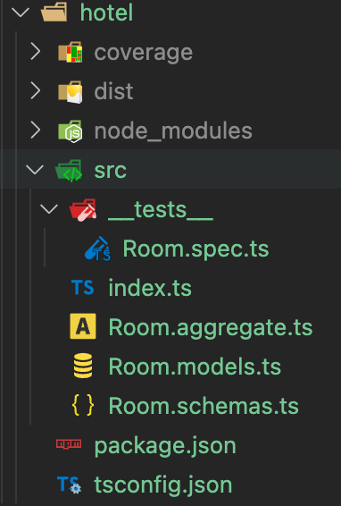
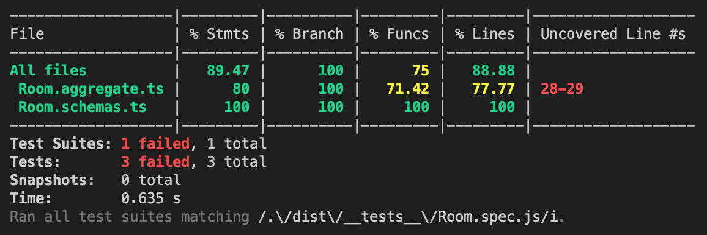
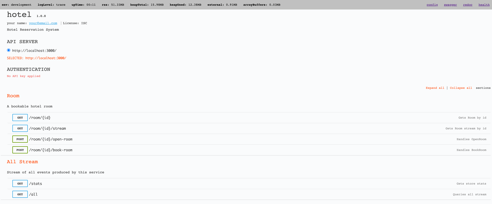

# Eventually Monorepo


[](https://coveralls.io/github/Rotorsoft/eventually-monorepo?branch=master)

## Writing a Hotel Reservation System

This tutorial was inspired by [https://medium.com/thedevproject/clean-architecture-a-basic-example-of-folders-organization-aab07f9eea68](https://medium.com/thedevproject/clean-architecture-a-basic-example-of-folders-organization-aab07f9eea68). Here we will show a different approach to coding the same API using [Eventually](./libs/eventually/README.md).

### **1.** Domain Model

In [Eventually](./libs/eventually/README.md), **the model** is king, and code is just a side effect. All important decisions are made on the modeling surface before they get transferred to code.

> We recommend using [Event Storming](https://www.eventstormingcom/) or [Event Modeling](https://eventmodeling.org/) to clearly define what we are trying to build in lego-like business-friendly terms.

In this particular API, we are modeling:

- A hotel administrator that can open rooms to reservations - via `OpenRoom` commands
- Customers that can query a `Hotel` for available rooms - via `SearchRoom` query commands
- Customers that can book available rooms - via `BookRoom` commands

The Event Storming model is super simple and captures:

- A `Room` aggregate receiving `OpenRoom`, `BookRoom` commands and emitting `RoomOpened`, `RoomBooked` events that are projected into a `Hotel` read model


### **2.** Schemas

Aggregates and Read Models have **State** that can be stored. We must think about the shape and validation guards of these schemas next..._following the original post_:

```typescript
export enum RoomType {
  SINGLE = "single",
  DOUBLE = "double",
  DELUXE = "deluxe"
}

export type Reservation = {
  id: string;
  checkin: Date;
  checkout: Date;
  totalPrice: number;
};

export type Room = {
  number: number;
  type: RoomType;
  price: number;
  reservations?: Reservation[];
};

export type Hotel = Record<number, Room>;
```

### **3.** Transfer Model to Code

With a model and clear schemas we are ready to code...

```bash
mkdir hotel
cd hotel
npm init # follow prompt
npx tsc --init
npm i --save zod @rotorsoft/eventually @rotorsoft/eventually-express
npm i --save-dev ts-node-dev jest @types/jest
```

#### _package.json_

```json
{
  "name": "hotel",
  "version": "1.0.0",
  "description": "Hotel Reservation System",
  "main": "index.js",
  "scripts": {
    "start:dev": "npx ts-node-dev --respawn ./src/index.ts",
    "test": "npx tsc && jest ./dist/**/*.spec.js"
  },
  "author": {
    "name": "your name",
    "email": "your@email.com"
  },
  "license": "ISC",
  "dependencies": {
    "@rotorsoft/eventually": "^5.0.0",
    "@rotorsoft/eventually-express": "^5.0.0",
    "zod": "^3.19.1"
  },
  "devDependencies": {
    "@types/jest": "^29.1.2",
    "jest": "^29.2.0",
    "ts-node-dev": "^2.0.0"
  }
}
```

#### _tsconfig.json_

```json
{
  "compilerOptions": {
    "module": "commonjs",
    "target": "ES2021",
    "sourceMap": true,
    "declaration": true,
    "declarationMap": true,
    "noImplicitAny": true,
    "esModuleInterop": true,
    "skipLibCheck": true,
    "sourceRoot": "./src",
    "outDir": "./dist"
  },
  "include": ["src"]
}
```

Add a dummy entry point _./src/index.ts_

```typescript
import { app } from "@rotorsoft/eventually";
import { ExpressApp } from "@rotorsoft/eventually-express";

app(new ExpressApp()).build();
void app().listen();
```

and make sure it runs...

```bash
LOG_LEVEL="trace" npm run start:dev
```

#### Transfer schemas

Message payloads also have schemas. We use [zod](https://zod.dev/) with type inference to define our schemas and types...

#### _./src/Room.schemas.ts_

```typescript
import { z } from "zod";

export enum RoomType {
  SINGLE = "single",
  DOUBLE = "double",
  DELUXE = "deluxe"
}

export const Reservation = z.object({
  id: z.string(),
  checkin: z.date(),
  checkout: z.date(),
  totalPrice: z.number()
});

export const Room = z.object({
  number: z.number(),
  type: z.nativeEnum(RoomType),
  price: z.number(),
  reservations: z.array(Reservation).optional()
});

export const BookRoom = z.intersection(
  z.object({
    number: z.number()
  }),
  Reservation
);

export const SearchRoom = z.object({
  checkin: z.date(),
  checkout: z.date()
});
```

#### _./src/Room.models.ts_

```typescript
import { z } from "zod";
import * as schemas from "./Room.schemas";

export type Reservation = z.infer<typeof schemas.Reservation>;
export type Room = z.infer<typeof schemas.Room>;
export type BookRoom = z.infer<typeof schemas.BookRoom>;
export type SearchRoom = z.infer<typeof schemas.SearchRoom>;

export type RoomCommands = {
  OpenRoom: Room;
  BookRoom: BookRoom;
};

export type RoomEvents = {
  RoomOpened: Room;
  RoomBooked: BookRoom;
};
```

#### A dummy version of _./src/Room.aggregate.ts`_

```typescript
import { Aggregate } from "@rotorsoft/eventually";
import * as schemas from "./Room.schemas";
import * as models from "./Room.models";

export const Room = (
  id: string
): Aggregate<models.Room, models.RoomCommands, models.RoomEvents> => ({
  schemas: {
    state: schemas.Room,
    commands: {
      OpenRoom: schemas.Room,
      BookRoom: schemas.BookRoom
    },
    events: {
      RoomOpened: schemas.Room,
      RoomBooked: schemas.BookRoom
    }
  },

  description: "A bookable hotel room",
  stream: () => `Room-${id}`,
  init: (): models.Room => ({
    number: +id,
    type: schemas.RoomType.SINGLE,
    price: 0
  }),
  reduce: {
    RoomOpened: () => undefined,
    RoomBooked: () => undefined
  },
  on: {
    OpenRoom: () => Promise.resolve([]),
    BookRoom: () => Promise.resolve([])
  }
});
```

Now we can finish _./src/index.ts_ by registering the new aggregate with the app builder...

```typescript
import { app, bootstrap, InMemorySnapshotStore } from "@rotorsoft/eventually";
import { ExpressApp } from "@rotorsoft/eventually-express";
import { Room } from "./Room.aggregate";

void bootstrap(async (): Promise<void> => {
  app(new ExpressApp()).with(Room).build();
  await app().listen();
});
```

Since we are using **ExpressApp**, the aggregate should be now exposed by HTTP endpoints...

```bash
LOG_LEVEL="trace" npm run start:dev
...
[INFO] 15:40:54 ts-node-dev ver. 2.0.0 (using ts-node ver. 10.9.1, typescript ver. 4.7.2)
[12417] ✨ config
[12417] ✨ devLog
[12417] ✨ ExpressApp
 GET  /room/:id
 GET  /room/:id/stream
 GET  /room
 POST  /room/:id/open-room
 POST  /room/:id/book-room
 GET  /all?[stream=...][&names=...][&after=-1][&limit=1][&before=...][&created_after=...][&created_before=...]
 GET  /_stats
Express app is listening  {
  env: 'development',
  port: 3000,
  logLevel: 'trace',
  service: 'hotel',
  version: '1.0.0'
}
```

### **4.** Write Tests First

In this case, we will just implement a couple of basic tests following the original post, but these should be enough to cover most of the code we will write later...

> Always decide what you are testing before implementing the core logic (model guards/invariants and projections)

#### _./src/\_\_tests\_\_/Room.spec.ts_

```typescript
import {
  app,
  client,
  dispose,
  InMemorySnapshotStore,
  Snapshot
} from "@rotorsoft/eventually";
import { Room } from "../Room.aggregate";
import * as models from "../Room.models";
import * as schemas from "../Room.schemas";

const openRoom = (
  room: models.Room
): Promise<Snapshot<models.Room, models.RoomEvents>[]> =>
  client().command(Room, "OpenRoom", room, { id: room.number.toString() });

const bookRoom = (
  number: number,
  reservation: models.Reservation
): Promise<Snapshot<models.Room, models.RoomEvents>[]> =>
  client().command(
    Room,
    "BookRoom",
    { number, ...reservation },
    { id: number.toString() }
  );

describe("Room", () => {
  const snapshotStore = InMemorySnapshotStore();

  beforeAll(async () => {
    app().with(Room).build();
    await app().listen();

    await openRoom({ number: 101, price: 100, type: schemas.RoomType.SINGLE });
    await openRoom({ number: 102, price: 200, type: schemas.RoomType.DOUBLE });
    await openRoom({ number: 103, price: 300, type: schemas.RoomType.DELUXE });
  });

  afterAll(async () => {
    await dispose()();
  });

  it("should search rooms", async () => {
    const rooms = await snapshotStore.query({});
    expect(rooms.length).toBe(3);
  });

  it("should book room", async () => {
    const checkin = new Date();
    const checkout = new Date(checkin.getTime() + 2 * 24 * 60 * 60 * 1000);
    const room = await bookRoom(102, {
      id: "r1",
      checkin,
      checkout,
      totalPrice: 0
    });
    expect(room[0].state?.reservations?.length).toBe(1);
    expect(room[0].state?.reservations[0].totalPrice).toBe(
      2 * room[0].state.price
    );
  });

  it("should fail booking", async () => {
    const checkin = new Date();
    const checkout = new Date(checkin.getTime() + 2 * 24 * 60 * 60 * 1000);
    await bookRoom(103, {
      id: "r2",
      checkin,
      checkout,
      totalPrice: 0
    });
    await expect(
      bookRoom(103, {
        id: "r3",
        checkin,
        checkout,
        totalPrice: 0
      })
    ).rejects.toThrowError();
  });
});
```

Your project should look like this...



### **5.** Finish the API

At this point all tests are failing...



We can now focus on closing the implementation gaps...

```typescript
import { Aggregate, bind } from "@rotorsoft/eventually";
import * as schemas from "./Room.schemas";
import * as models from "./Room.models";

const nights = (reservation: models.Reservation): number => {
  const dtime = reservation.checkout.getTime() - reservation.checkin.getTime();
  return Math.round(dtime / (1000 * 3600 * 24));
};

const isBooked = (room: models.Room, from: Date, to: Date): boolean =>
  room.reservations &&
  room.reservations.some(
    (r) =>
      (from >= r.checkin && from <= r.checkout) ||
      (to >= r.checkin && to <= r.checkout) ||
      (r.checkin >= from && r.checkin <= to) ||
      (r.checkout >= from && r.checkout <= to)
  );

export const Room = (
  id: string
): Aggregate<models.Room, models.RoomCommands, models.RoomEvents> => ({
  schemas: {
    state: schemas.Room,
    commands: {
      OpenRoom: schemas.Room,
      BookRoom: schemas.BookRoom
    },
    events: {
      RoomOpened: schemas.Room,
      RoomBooked: schemas.BookRoom
    }
  },

  description: "A bookable hotel room",
  stream: () => `Room-${id}`,
  init: (): models.Room => ({
    number: +id,
    type: schemas.RoomType.SINGLE,
    price: 0
  }),
  reduce: {
    RoomOpened: (state, event) => event.data,
    RoomBooked: (state, event) => ({
      ...state,
      reservations: (state?.reservations || []).concat({
        ...event.data,
        totalPrice: nights(event.data) * state.price
      })
    })
  },
  on: {
    OpenRoom: (data) => Promise.resolve([bind("RoomOpened", data)]),
    BookRoom: (data, state) => {
      if (isBooked(state, data.checkin, data.checkout))
        throw Error(`Room ${state.number} is booked.`);
      return Promise.resolve([bind("RoomBooked", data)]);
    }
  }
});
```

At this point all unit tests should pass with excellent coverage...


The service also provides a default homepage with the OpenAPI spec of the service and a few links to stats and metadata...

> Local development defaults to <http://localhost:3000>



### Hotel Projections

Room events can be projected into read models that are useful to feed the user interface or make policy decisions. Here you can find a [Hotel](./services/hotel/src/Hotel.projector.ts) projector with the current state of all rooms, and a second [Next30Days](./services/hotel/src/Next30Days.projector.ts) projector keeping track of room sales looking forward 30 days. The sample application exposes a very basic `/home` view, showing how these projections can be used to feed the UI.

### Testing the API

You can use any of the following HTTP test clients to validate the API:

- REST Client VSCode extension
- Thunder Client VSCode extension
- Postman

Here is a sample REST Client file:

#### _./http/Room.http_

```bash
@host = http://localhost:3000

### Try to open room 101 with invalid command
POST {{host}}/room/101/open-room
Content-Type: application/json

{
  "number": "101"
}

### Open room 101
POST {{host}}/room/101/open-room
Content-Type: application/json

{
  "number": 101,
  "price": 100,
  "type": "single"
}

### Try to open room 102 with invalid type
POST {{host}}/room/102/open-room
Content-Type: application/json

{
  "number": "102",
  "price": 200,
  "type": "invalid"
}

### Open room 102
POST {{host}}/room/102/open-room
Content-Type: application/json

{
  "number": 102,
  "price": 200,
  "type": "double"
}

### Book room 101
POST {{host}}/room/101/book-room
Content-Type: application/json

{
  "id": "booking-1",
  "number": 101,
  "checkin": "2022-12-01",
  "checkout": "2022-12-03",
  "totalPrice": 0
}

### Try to book room 101 again
POST {{host}}/room/101/book-room
Content-Type: application/json

{
  "id": "booking-1",
  "number": 101,
  "checkin": "2022-12-01",
  "checkout": "2022-12-03",
  "totalPrice": 0
}

### Get Room 101
GET {{host}}/room/101

### Get Room 101 stream
GET {{host}}/room/101/stream

### Get Rooms
GET {{host}}/room

### Get store stats
GET {{host}}/_stats

### Get internal subscriptions
GET {{host}}/_subscriptions
```

## Generic Services

In this example, we created a new `hotel` service containing room artifacts and the service configuration in `index.ts`. In production systems, we can streamline this process by separating artifact containers from service configuration via [preconfigured generic services](./libs/eventually-service-expg/README.md).
