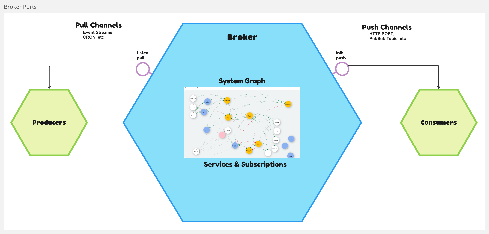

# [eventually-broker](https://rotorsoft.github.io/eventually-monorepo/modules/eventually_broker_src.html)

[](https://www.npmjs.com/package/@rotorsoft/eventually-broker)

## Message Broker

This library implements a very simple message broker abstraction that centralizes system configuration, service discovery, contract mapping, and basic observability. It uses a pull-push communication pattern that connects event streams from producers to consumers at a higher (system) level. Services don't need to know about this abstraction, they just produce or react to interesting things that happen (events).  

Unlike other message brokers, like Kafka or RabbitMQ, this broker doesn't store messages in queues or streams. [Eventually](../eventually/README.md) services own their event stores, and the broker just connects the streams.

The broker uses `Pull Channels` to listen to and pull from producing services, and `Push Channels` to push to consumers.



## Services and Subscriptions

TODO: Documentation

### Service Paths

* GET `/services` - Lists all services
* GET `/services/:id` - Shows service with id, admins can edit
* GET `/services/:id/events` - Queries service events
* GET `/services/:id/events/:eid` - Gets service event by id
* GET `/services/:id/stream/:sid` - Queries service stream
* GET `/services?add=true` - Admins can add new services
* POST `/services` - Adds a new service
* POST `/services/:id` - Updates an existing service
* DELETE `/services/:id` - Deletes existing service

### Subscription Paths

* GET `/subscriptions` - Lists all subscriptions
* GET `/subscriptions/:id` - Shows subscription with id, admins can edit
* GET `/subscriptions?add=true` - Admins can add new subscription
* GET `/subscriptions?search=criteria` - Filters subscriptions by criteria
* POST `/subscriptions` - Adds a new subscription
* POST `/subscriptions/:id` - Updates an existing subscription
* DELETE `/subscriptions/:id` - Deletes existing subscription

## Services Graph

TODO: Documentation

* GET `/graph`

## Correlation Explorer

TODO: Documentation

* GET `/correlations/:id`

## Contracts Explorer

* GET `/contracts`

## Discovering Service Contracts

The broker automatically polls HTTP services every 30 seconds at **GET** `/swagger` and expects a JSON representation of the OpenAPI Spec3. It uses this data to consolidate event contracts into a single view. The spec interpreter follows these simple conventions:

* All event schemas (consumed or produced) by the service are included in the spec components section `#/components/schemas`
* All event handler paths are represented as **POST** methods and include references `#ref` to **consumed** event schemas in the `requestBody`
* Events not found referenced by handler paths are considered events **produced** by this service
* All event schemas are object types with the following fields:
  * name: `string` - constrained by `enum` with the event name
  * created: `datetime`
  * data: (optional) - event payload schema

### Example

```json
{
  "openapi": "3.0.3",
  "info": {
    "title": "calculator",
    "version": "1.0.0",
    "description": "Calculator API"
  },
  ...
  "components": {
     ...
    "schemas": {
      ... 
      "DigitPressed": {
        "type": "object",
        "properties": {
          "name": { "type": "string", "enum": ["DigitPressed"] },
          "id": { "type": "integer" },
          "stream": { "type": "string" },
          "version": { "type": "integer" },
          "created": { "type": "string", "format": "date-time" },
          "data": {
            "type": "object",
            "properties": {
              "digit": {
                "type": "string",
                "enum": ["0", "1", "2", "3", "4", "5", "6", "7", "8", "9"]
              }
            },
            "required": ["digit"],
            "additionalProperties": false
          }
        },
        "required": ["name", "id", "stream", "version", "created", "data"],
        "additionalProperties": false,
        "name": "DigitPressed",
        "description": "Generated when a **digit** is pressed\n\nThis is and example to use\n* markup language\n* inside descriptions"
      },
      "OperatorPressed": {
        "type": "object",
        "properties": {
          "name": { "type": "string", "enum": ["OperatorPressed"] },
          "id": { "type": "integer" },
          "stream": { "type": "string" },
          "version": { "type": "integer" },
          "created": { "type": "string", "format": "date-time" },
          "data": {
            "type": "object",
            "properties": {
              "operator": { "type": "string", "enum": ["+", "-", "*", "/"] }
            },
            "required": ["operator"],
            "additionalProperties": false
          }
        },
        "required": ["name", "id", "stream", "version", "created", "data"],
        "additionalProperties": false,
        "name": "OperatorPressed",
        "description": "Generated when operator is pressed"
      }
      ...
    }
  },
  "paths": {
    ...
    "/counter": {
      "post": {
        "operationId": "Counter",
        "tags": ["Counter"],
        "summary": "Handle Counter Events",
        "requestBody": {
          "required": true,
          "content": {
            "application/json": {
              "schema": {
                "oneOf": [
                  { "$ref": "#/components/schemas/DigitPressed" },
                  ...
                  { "$ref": "#/components/schemas/OperatorPressed" }
                ]
              }
            }
          }
        },
        ...
      }
    }
  }
}
```

## APIs

* GET `/api/events`

## Customizing the Broker

TODO: Document how to customize application with injected handlers, middleware, secrets, etc.
