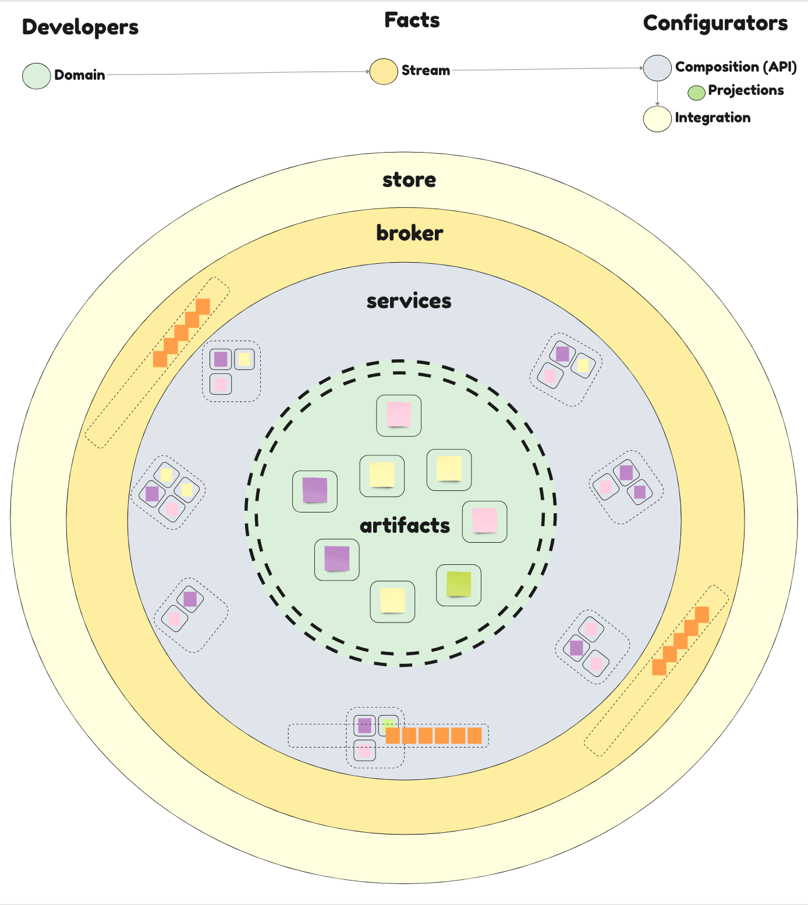

# Generic Services

In eventually we can separate core domain artifacts from implementation and configuration details following hexagonal/onion architectural principles. This approach allows us to compose artifact packages in different service level configurations.



`eventually-service-expg` implements a specific generic service using [Express](../eventually-express/README.md) and [Postgres](../eventually-pg/README.md) adapters, and can be easily configured by declaring the required artifacts in `package.json`.

## Steps to build a generic service

- Create project (optional) - a service can be started just by pointing at a folder with an installed `package.json` and `.env` file)

```bash
mkdir generic-service
cd generic-service
npm init -y
npm i @rotorsoft/eventually-service-expg @rotorsoft/calculator-artifacts
```

- Declare the artifacts you want to deploy in `package.json` under the `eventually` section
- Add a `start` script pointing to the generic service index

```json
{
    "name": "generic-service",
    "description": "Generic Service",
    "version": "1.0.0",
    "main": "index.js",
    "scripts": {
        "start": "node ./node_modules/@rotorsoft/eventually-service-expg/dist"
    },
    "author": {
        "name": "name",
        "email": "email@email.com"
    },
    "license": "ISC",
    "keywords": [],
    "dependencies": {
        "@rotorsoft/calculator-artifacts": "^1.0.0",
        "@rotorsoft/eventually-service-expg": "^1.0.0"
    },
    "eventually": {
        "store": "calculator",
        "artifacts": {
            "@rotorsoft/calculator-artifacts": ["Calculator", "Counter", "PressKeyAdapter"]
        }
    }
}
```

- Configure PG in `.env` file

```bash
LOG_LEVEL="info"
PG_HOST="localhost"
PG_USER="postgres"
PG_DATABASE="postgres"
PG_PASSWORD="postgres"
```

- Run Service

```bash
npm run start
```
