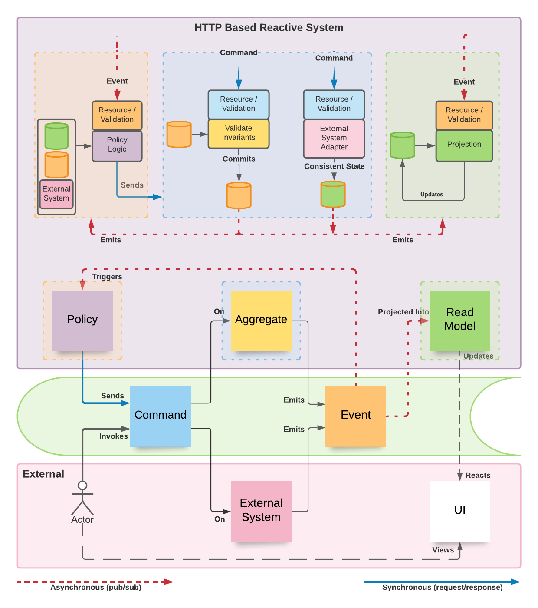

# Eventually Framework

This project aims at the exploration of different ideas around building reactive web services. Based on well known methodologies, patterns, and tools - our guiding principle is **simplicity**.

## Methodologies-Patterns-Tools

- Domain Driven Design - DDD
- Event Storming
- Event Sourcing
- Command Query Responsibility Segregation - CQRS
- TypeScript 3 Project References
- Yarn 2 Zero Installs, Plug and Play, Workspaces
- Monorepo Structure
- Test Driven Development - TDD
- ESLint, Prettier, Jest
- ...More to come

## Logical Model

Software engineering should be approached as a “group learning process”, a close collaboration among clients, domain experts, and engineers that iteratively produces “clear models” as the drivers of implementations - source code should be seen as a side effect. The deeper we can track these models within the implementation the better.

> Tackle complexity early by understanding the domain

Event Sourcing is a practical methodology used by many to model business processes. The nice thing about it is how easiliy models get tranferred to source code. The working patterns of any reactive system can be identified in the diagram below using the colors prescribed by Event Storming:

## Value Proposition

This project is trying to answer the following questions:

- **Future Proof Single Source of Truth** - The “append-only” nature of an Event Store is an old and battle tested concept. We can audit and fully reproduce or re-project history by just replaying the log.

- **Transparent Model-To-Implementation Process** - Developers focus on transferring business models to code with minimal technical load. We use a “convention over configuration” philosophy to remove tedious technical decision making from the process

- **Ability to Swap Platform Services** - Frameworks, protocols, and other platform related services are abstracted away from the developer

- **Practically Self-Testable** - Replaying event streams effectively tests/covers models and business rules - one generic unit test

## Building your first Micro-Service

> The anatomy of a micro-service should reflect the business model

From a technical perspective, our reactive microservices should encapsulate a small number of protocol-agnostic message handlers in charge of solving very specific business problems. These handlers are grouped together logically according to the domain model, and can be optionally streamable or reducible to some kind of pesistent state if needed. The table below presents all these options and their proper mapping to DDD:

<table>
    <tr>
        <th>Message Handler</th>
        <th>Consumes</th>
        <th>Produces</th>
        <th style="text-align:center">Streamable</th>
        <th style="text-align:center">Reducible</th>
        <th>DDD Artifact</th>
    </tr>
    <tr>
        <td rowspan="2">Command Handlers</td>
        <td rowspan="2" style="color:cyan">Commands</td>
        <td rowspan="2" style="color:orange">Events</td>
        <td style="text-align:center">Yes</td>
        <td style="text-align:center">Yes</td>
        <td style="color:yellow">Aggregate</td>
    </tr>
    <tr>
        <td style="text-align:center">Yes</td>
        <td style="text-align:center">No</td>
        <td style="color:pink">External System</td>
    </tr>
    <tr>
        <td rowspan="2">Event Handlers</td>
        <td rowspan="2" style="color:orange">Events</td>
        <td rowspan="2" style="color:cyan">Commands</td>
        <td style="text-align:center">Yes</td>
        <td style="text-align:center">Yes</td>
        <td style="color:purple">Process Manager</td>
    </tr>
    </tr>
        <td style="text-align:center">No</td>
        <td style="text-align:center">No</td>
        <td style="color:purple">Policy</td>
    </tr>
</table>

Aggregates define the consistency boundaries of business entities while process managers can expand those boundaries across many aggregates or systems.

### Public and Private Messages

Commands and Events can have either public of private scope. Public messages are used for integrations with other services by exposing public endpoints (e.g. HTTP POST) and their schemas are usually bigger and more stable. Public events are published to the message broker with `at-least-once` delivery guarantees and are expected to be eventually consumed by either pub/sub or polling patterns.

Private messages are limited to the internal application scope and get delivered synchronously (in-process) inside a single transaction context. Private schemas are usually smaller and can change more frequently.

The sequence below shows two `{{ systems }}` exchanging a public event while processing internal private flows within `[[ transaction ]]` contexts.

`command -> {{ system1 -> [[ private-event1 -> policy1 -> private-command1 -> aggregate1 -> public-event1 ]] }} -> public-event1 -> {{ policy2 -> private-command2 -> system2 -> [[ private-event2 ]] }}`

## Routing conventions (using REST protocol by default)

Public message handlers are routed by convention. Getters provide the current state of reducible artifacts, and can be used to audit their streams or for integrations via polling:

| Artifact        | Handler                                     | Getters                                                                |
| --------------- | ------------------------------------------- | ---------------------------------------------------------------------- |
| Aggregate       | `POST /aggregate-type/:stream/command-name` | `GET /aggregate-type/:stream` `GET /aggregate-type/:stream/stream` |
| Process Manager | `POST /manager-type/event-name`             | `GET /manager-type/:stream` `GET /manager-type/:stream/stream`     |
| External System | `POST /system-type/command-name`            | `GET /all?stream=system-type`                                          |
| Policy          | `POST /policy-type/event-name`              | `N/A`                                                                  |
| All Stream      | `N/A`                                       | `GET /all?[stream=stream-type]&[name=event-name]&[after=-1]&[limit=1]` |

## Testing your code

We group our unit tests inside the `__tests__` folder. We want tests only focusing on application logic, and we are planning to provide tooling to facilitate this. The `test_command` utility simulates commands flows in memory and covers messages payload validations automatically.
