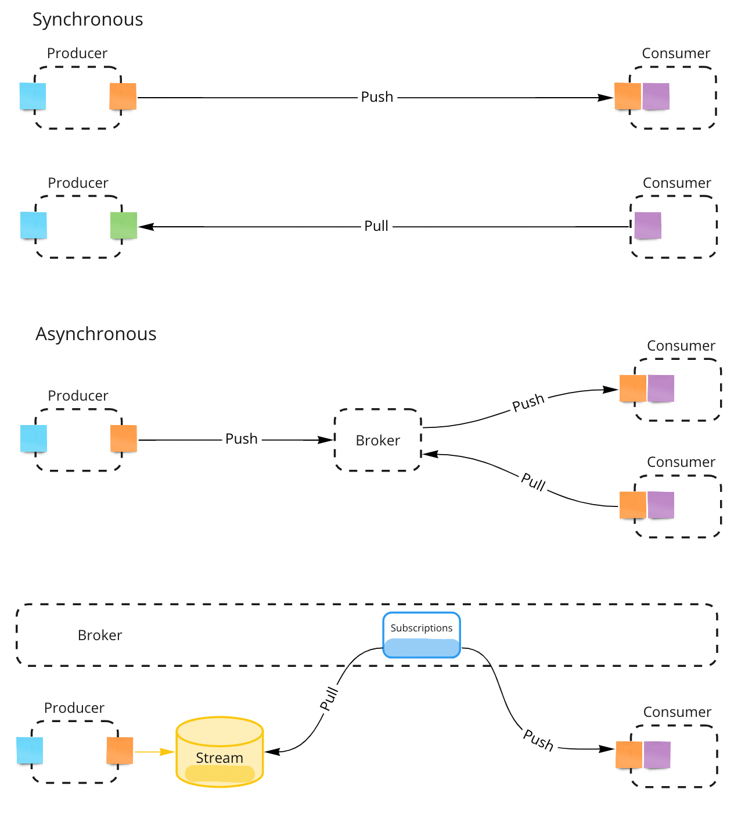

# Eventually Framework

This project aims at exploring practical ideas around building reactive microservices. Our goal is to provide a simple recipe for general business applications grounded on well known methodologies, patterns, and tools. Here we will test these old concepts and make some assumptions based on our own experiences with real systems, but be aware this in no way tries to cover all possible use cases.

## Methodologies, Patterns, and Tools

- [Domain Driven Design](https://martinfowler.com/bliki/DomainDrivenDesign.html) - DDD
- [The Reactive Manifesto](https://www.reactivemanifesto.org/)
- [Event Storming](https://www.eventstorming.com/)
- [Event Sourcing](https://martinfowler.com/eaaDev/EventSourcing.html) - ES
- [Command Query Responsibility Segregation](https://martinfowler.com/bliki/CQRS.html) - CQRS
- [Test Driven Development](https://martinfowler.com/bliki/TestDrivenDevelopment.html) - TDD
- [TypeScript Project References](https://www.typescriptlang.org/docs/handbook/project-references.html)
- [Yarn 2 Zero Installs](https://yarnpkg.com/features/zero-installs)- [Yarn 2 Plug'n'Play](https://yarnpkg.com/features/pnp)
- [Yarn 2 Workspaces](https://yarnpkg.com/features/workspaces) - Monorepo Structure

## Logical Domain Models

> Tackle complexity early by understanding the domain

Software engineering should be approached as a “group learning process”, a close collaboration among clients, domain experts, and engineers that iteratively produces “clear business models” as the drivers of implementations - [source code should be seen as a side effect](https://www.lambdabytes.io/posts/selearning/). **The deeper we can track these models within the implementation the better**.

We recommend using the [Event Storming](https://www.eventstorming.com/) methodology as the neccesary first step to understand and model what we are trying to build. This methodology is extremely easy to learn by both the technical and business communities, and plays very nicely with the other tools we recommend here (DDD, ES, CQRS). The resulting models can usually get **tranferred** to source code by straightforward one-to-one mappings to DDD artifacts and the working patterns of reactive systems.

## Value Proposition

This project is also trying to address the following issues:

- **Future Proof Single Source of Truth** - The “append-only” nature of event sourced systems is an old and battle tested concept. The replayability aspect of it guarantees full auditability, integrability, and testability.

- **Transparent Model-To-Implementation Process** - Focus on transferring business models to code with minimal technical load. A “convention over configuration” philosophy removes tedious decision making from the process.

- **Ability to Swap Platform Services** - Abstractions before frameworks, protocols, or any other platform services.

## Building your first Reactive Micro-Service

> The anatomy of a micro-service should reflect the business model

From a technical perspective, reactive microservices encapsulate a small number of protocol-agnostic message handlers in charge of solving specific business problems. These handlers are grouped together logically according to a domain model, and can be optionally streamable or reducible to some kind of pesistent state if needed. The table below presents all practical options available and their proper mapping to DDD:

<table>
    <tr>
        <th>Message Handler</th>
        <th>Consumes</th>
        <th>Produces</th>
        <th style="text-align:center">Streamable</th>
        <th style="text-align:center">Reducible</th>
        <th>DDD Artifact</th>
    </tr>
    <tr>
        <td rowspan="2">Command Handlers</td>
        <td rowspan="2" style="color:cyan">Commands</td>
        <td rowspan="2" style="color:orange">Events</td>
        <td style="text-align:center">Yes</td>
        <td style="text-align:center">Yes</td>
        <td style="color:yellow">Aggregate</td>
    </tr>
    <tr>
        <td style="text-align:center">Yes</td>
        <td style="text-align:center">No</td>
        <td style="color:pink">External System</td>
    </tr>
    <tr>
        <td rowspan="2">Event Handlers</td>
        <td rowspan="2" style="color:orange">Events</td>
        <td rowspan="2" style="color:cyan">Commands</td>
        <td style="text-align:center">Yes</td>
        <td style="text-align:center">Yes</td>
        <td style="color:purple">Process Manager</td>
    </tr>
    </tr>
        <td style="text-align:center">No</td>
        <td style="text-align:center">No</td>
        <td style="color:purple">Policy</td>
    </tr>
</table>

> - `Aggregates` define the consistency boundaries of business entities
> - `Process Managers` can expand those boundaries across many aggregates or systems

## Composing complex systems from small reactive micro-services

The biggest question we usually face when implementing real micro-service based systems is "how to move information around services?". There are several well-known integration patterns available but in general we can divide services into "producers" and "consumers" of information. Producers are "upstream" of consumers (or consumers "downstream" of producers). Since services are separated by network boundaries, this information gets transferred via network "messages" and there are basically two ways to accomplish this - "synchronously" or "asynchronously".

As system architects we need to decide how information flows from service to service in order to accomplish a specific business goal. We need to understand the tradeoffs when choosing synchronous vs. asynchronous messaging styles as well as consider message contracts and what happens when these change over time. There are no right or wrong answers here but we will try to provide some basic rules based on simple conventions and practical principles.

- There are only two types of messages (according to DDD)
  - **Commands**: Imperative actions invoked by human or machine actors. Can be rejected when business invariants are not met
  - **Events**: Represent interesting "things" that already happened in the system (named in past tense). Used to communicate these "things" to the rest of the system
- Commands are synchronous (request/reply patterns) and Events asynchronous (pub/sub patterns)
- Events are transferred by message brokers with `at-least-once` delivery guarantees. Events are expected to be eventually consumed by downstream services "subscribed" to event streams.
- Producers and Consumers don't need to know about each other (in a fully decoupled system). A broker service will sit at a higher abstraction level to deal with channel subscriptions and communications.
- We use "Event Sourcing" to persist all produced events as consumable streams.
- Asynchronous business flows can be designed by connecting consumers with producers via event subscriptions
- Synchronous flows are also possible (querying read only projections are a common use case) but not recommended in general

### Integration Patterns

## Routing conventions (using REST protocol by default)

Message handlers are routed by convention. Getters provide the current state of reducible artifacts, and can be used to audit their streams or for integrations via polling:

| Artifact        | Handler                         | Getters                                                                  |
| --------------- | ------------------------------- | ------------------------------------------------------------------------ |
| Aggregate       | `POST /aggregate/:id/command`   | `GET /aggregate/:id` `GET /aggregate/:id/stream`                     |
| Process Manager | `POST /process-manager`         | `GET /process-manager/:stream` `GET /process-manager/:stream/stream` |
| External System | `POST /external-system/command` | `GET /all?stream=external-system`                                        |
| Policy          | `POST /policy`                  | `N/A`                                                                    |
| All Stream      | `N/A`                           | `GET /all?[stream=...][&names=...][&after=-1][&limit=1][&before=...][&created_after=...][&created_before=...]`             |

## Testing your code

We group unit tests inside `__tests__` folders. Tests should mainly focus on testing business logic and follow this basic pattern:

- `given` [messages] `when` [message] `expect` [state]
