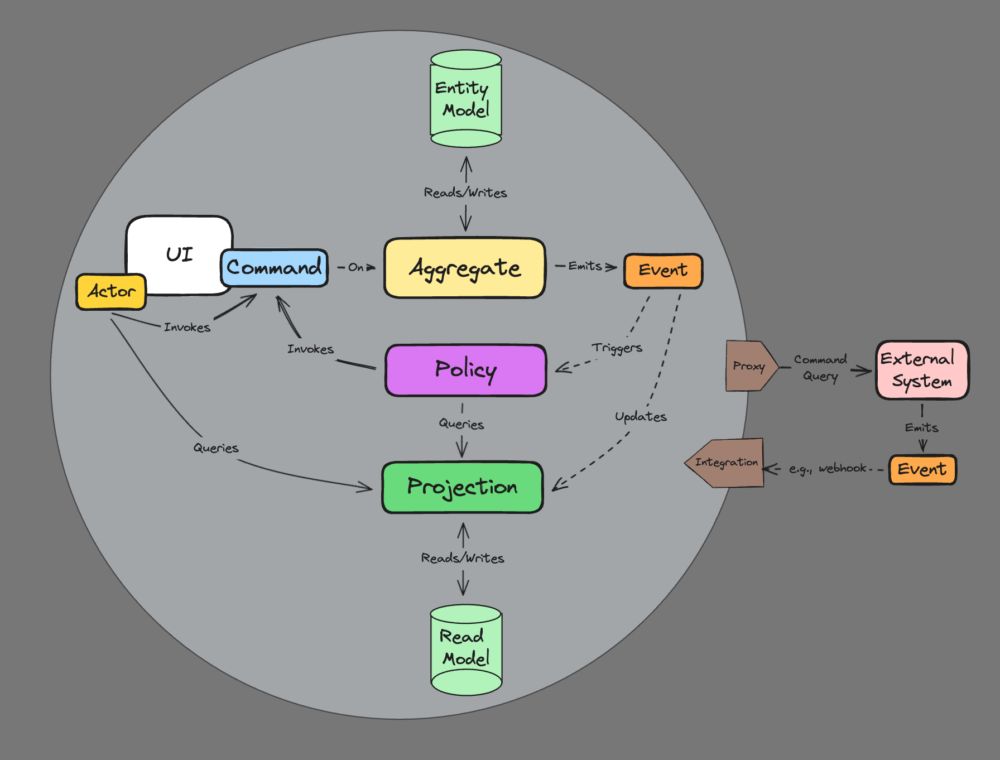

# Eventually Framework

This project aims at exploring practical ideas around building reactive microservices. Our goal is to provide simple recipes grounded on well known methodologies, patterns, and tools.

## Methodologies, Patterns, and Tools

- [Domain Driven Design](https://martinfowler.com/bliki/DomainDrivenDesign.html) - DDD
- [The Reactive Manifesto](https://www.reactivemanifesto.org/)
- [Event Storming](https://www.eventstorming.com/)
- [Event Sourcing](https://martinfowler.com/eaaDev/EventSourcing.html) - ES
- [Command Query Responsibility Segregation](https://martinfowler.com/bliki/CQRS.html) - CQRS
- [Test Driven Development](https://martinfowler.com/bliki/TestDrivenDevelopment.html) - TDD
- [TypeScript Project References](https://www.typescriptlang.org/docs/handbook/project-references.html)
- [Yarn 2 Zero Installs](https://yarnpkg.com/features/zero-installs)- [Yarn 2 Plug'n'Play](https://yarnpkg.com/features/pnp)
- [Yarn 2 Workspaces](https://yarnpkg.com/features/workspaces) - Monorepo Structure

## Logical Model

Software engineering should be approached as a “group learning process”, a close collaboration among clients, domain experts, and engineers that iteratively produces “clear business models” as the drivers of implementations - [source code should be seen as a side effect](https://www.lambdabytes.io/posts/selearning/). **The deeper we can track these models within the implementation the better**.

> Tackle complexity early by understanding the domain

[Event Storming](https://www.eventstorming.com/) is a business process modeling methodology that plays very nicely with the other tools we recommend here (DDD, ES, CQRS). We find it extremely easy to learn by both the technical and business communities, and the final models can usually get tranferred to source code by straightforward one-to-one mappings to DDD artifacts and the working patterns of reactive systems as shown below:

## Value Proposition

This project is trying to answer the following questions:

- **Future Proof Single Source of Truth** - The “append-only” nature of event sourced systems is an old and battle tested concept. The replayability aspect of it guarantees full auditability, integrability, and testability.

- **Transparent Model-To-Implementation Process** - Focus on transferring business models to code with minimal technical load. A “convention over configuration” philosophy removes tedious decision making from the process.

- **Ability to Swap Platform Services** - Abstractions before frameworks, protocols, or any other platform services.

## Building your first Micro-Service

> The anatomy of a micro-service should reflect the business model

From a technical perspective, reactive microservices encapsulate a small number of protocol-agnostic message handlers in charge of solving specific business problems. These handlers are grouped together logically according to a domain model, and can be optionally streamable or reducible to some kind of pesistent state if needed. The table below presents all practical options available and their proper mapping to DDD:

<table>
    <tr>
        <th>Message Handler</th>
        <th>Consumes</th>
        <th>Produces</th>
        <th style="text-align:center">Streamable</th>
        <th style="text-align:center">Reducible</th>
        <th>DDD Artifact</th>
    </tr>
    <tr>
        <td rowspan="2">Command Handlers</td>
        <td rowspan="2" style="color:cyan">Commands</td>
        <td rowspan="2" style="color:orange">Events</td>
        <td style="text-align:center">Yes</td>
        <td style="text-align:center">Yes</td>
        <td style="color:yellow">Aggregate</td>
    </tr>
    <tr>
        <td style="text-align:center">Yes</td>
        <td style="text-align:center">No</td>
        <td style="color:pink">External System</td>
    </tr>
    <tr>
        <td rowspan="2">Event Handlers</td>
        <td rowspan="2" style="color:orange">Events</td>
        <td rowspan="2" style="color:cyan">Commands</td>
        <td style="text-align:center">Yes</td>
        <td style="text-align:center">Yes</td>
        <td style="color:purple">Process Manager</td>
    </tr>
    </tr>
        <td style="text-align:center">No</td>
        <td style="text-align:center">No</td>
        <td style="color:purple">Policy</td>
    </tr>
</table>

> `Aggregates` define the consistency boundaries of business entities while `Process Managers` can expand those boundaries across many aggregates or systems.

### Public and Private Messages

`Commands` and `Events` can have either public of private scope.

Public messages are used for integrations with other micro-services by exposing public endpoints (e.g. HTTP POST).

- Public schemas are usually bigger and more stable
- Public events are published to the message broker with `at-least-once` delivery guarantees and are expected to be eventually consumed by either pub/sub or polling patterns
- Event handlers handling public events are subscribed to a producer service topic by default

Private messages are limited to the boundaries of the micro-service

- Private messages get delivered synchronously (in-process) inside a single transaction context
- Private schemas are usually smaller and can change more frequently

The diagram below shows a few patterns we can use to build services

> A micro-service can have any number of message handling layers, but we try to keep it around two when possible

A producer service usually exposes a public command handling interface targetting aggregates or systems and produces events. A consumer service exposes a public event handling interface (subscribed to a producer) and targets policies or process managers. Any number of internal (synchronous) middle layers can be added following the same event->command->event sequence, but it's not recommended if we want to build a loosely coupled system.

## Routing conventions (using REST protocol by default)

Public message handlers are routed by convention. Getters provide the current state of reducible artifacts, and can be used to audit their streams or for integrations via polling:

| Artifact        | Handler                         | Getters                                                                  |
| --------------- | ------------------------------- | ------------------------------------------------------------------------ |
| Aggregate       | `POST /aggregate/:id/command`   | `GET /aggregate/:id` `GET /aggregate/:id/stream`                     |
| Process Manager | `POST /process-manager`         | `GET /process-manager/:stream` `GET /process-manager/:stream/stream` |
| External System | `POST /external-system/command` | `GET /all?stream=external-system`                                        |
| Policy          | `POST /policy`                  | `N/A`                                                                    |
| All Stream      | `N/A`                           | `GET /all?[stream=...][&names=...][&after=-1][&limit=1][&before=...][&created_after=...][&created_before=...]`             |

## Testing your code

We group unit tests inside `__tests__` folders. Tests should mainly focus on testing business logic and follow this basic pattern:

- `given` [messages] `when` [message] `expect` [state]
