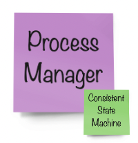

# Eventually Framework

This project aims at exploring practical ideas around reactive micro-services. Our goal is to provide a simple recipe for building general business applications grounded on well known methodologies, patterns, and tools. Here we will test these old concepts and make some assumptions based on our own experiences with real systems, but be aware this in no way tries to cover all possible use cases.

## Methodologies, Patterns, and Tools

- [Domain Driven Design](https://martinfowler.com/bliki/DomainDrivenDesign.html) - DDD
- [The Reactive Manifesto](https://www.reactivemanifesto.org/)
- [Event Storming](https://www.eventstorming.com/)
- [Event Sourcing](https://martinfowler.com/eaaDev/EventSourcing.html) - ES
- [Command Query Responsibility Segregation](https://martinfowler.com/bliki/CQRS.html) - CQRS
- [Hexagonal Architecture](https://en.wikipedia.org/wiki/Hexagonal_architecture_(software))
- [CUPID Principles](https://dannorth.net/2022/02/10/cupid-for-joyful-coding/)
- [Test Driven Development](https://martinfowler.com/bliki/TestDrivenDevelopment.html) - TDD
- [TypeScript Project References](https://www.typescriptlang.org/docs/handbook/project-references.html)
- [Yarn 2 Workspaces](https://yarnpkg.com/features/workspaces) - Monorepo Structure

## Logical Domain Models

> Tackle complexity early by understanding the domain

Software engineering should be approached as a “group learning process”, a close collaboration among clients, domain experts, and engineers that iteratively produces “clear business models” as the drivers of implementations - [source code should be seen as a side effect](https://www.lambdabytes.io/posts/selearning/).

> We believe in writing software that looks like the business. The deeper we can track business models within software projects and deployed infrastructure the easier to understand and adjust to future changes in business requirements.

We recommend using [Event Storming](https://www.eventstorming.com/) as the neccesary first step to understand and model what we are trying to build. This methodology is extremely easy to learn by both the technical and business communities, and plays very nicely with the other tools we recommend here (DDD, ES, CQRS). The resulting models can usually get **tranferred** to source code by straightforward one-to-one mappings to DDD artifacts and the working patterns of reactive systems.

## Value Proposition

This project is also trying to address the following issues:

- **Future Proof Single Source of Truth** - The “append-only” nature of event sourced systems is an old and battle tested concept. The replayability aspect of it guarantees full auditability, integrability, and testability.

- **Transparent Model-To-Implementation Process** - Focus on transferring business models to code with minimal technical load. A “convention over configuration” philosophy removes tedious decision making from the process.

- **Ability to Swap Platform Services** - Following the hexagonal architecture based on ports and adapters.

## Building your first Reactive Micro-Service

> The anatomy of a micro-service as a reflection of the business model

From a technical perspective, reactive microservices encapsulate a small number of protocol-agnostic message handlers in charge of solving specific business problems. These handlers are grouped together logically according to a domain model, and can be optionally streamable and reducible to some kind of pesistent state. The table below presents all available options and their proper mapping to DDD:

Message Handler | Consumes | Produces | Streamable | Reducible | DDD Artifact
--- | :---: | :---: | :---: | :---: | :---:
Command Handler |  |  | Yes | Yes | 
Command Handler |  |  | Yes | No | 
Event Handler |  |  | Yes | Yes | 
Event Handler |  |  | No | No | 
Event Handler |  |  | No | No | 

> - `Aggregates` define the consistency boundaries of business entities
> - `Process Managers` can expand those boundaries across many aggregates or systems

## Composing complex systems from small reactive micro-services

The biggest question we usually face when implementing real micro-service based systems is "how to move information around services?". There are several well-known integration patterns available but in general we can divide services into "producers" and "consumers" of information. Producers are "upstream" of consumers. Since services are separated by network boundaries, this information gets transferred via network "messages" either "synchronously" or "asynchronously".

As system architects we need to decide how information flows from service to service in order to accomplish a specific business goal. We need to understand the tradeoffs when choosing synchronous vs. asynchronous messaging styles as well as consider message contracts and what happens when these change over time. There are no right or wrong answers here but we will try to provide some basic rules based on simple conventions and practical principles.

- There are only two types of messages (according to DDD)
  - **Commands**: Imperative actions invoked by human or machine actors. Can be rejected when business invariants are not met
  - **Events**: Represent interesting "things" that already happened in the system (named in past tense). Used to communicate these "things" to the rest of the system
- Commands are synchronous (request/reply patterns)
- Events are asynchronous (pub/sub patterns) and transferred by message brokers with `at-least-once` and `in-order` delivery guarantees
- Events are expected to be eventually consumed by downstream services "subscribed" to event streams
- Producers and Consumers don't need to know about each other (in a fully decoupled system)
- We use "Event Sourcing" to persist all produced events as consumable streams. This guarantees `in-order` delivery
- Asynchronous business flows can be designed by connecting consumers with producers via subscriptions
- A broker service will sit at a higher level to deal with channel subscriptions and communications
- Synchronous flows are also possible (querying read only projections are a common use case) but not recommended in general

### Integration Patterns

Event Storming Models are like Lego games where there is only one way to connect the pieces (DDD artifacts)

But those pieces live inside domain contexts and physical services. In DDD you build larger systems by connecting domain contexts in [Context Maps](https://github.com/ddd-crew/context-mapping) following well-known integration patterns.

## Routing conventions

Message handlers are routed by convention. Getters provide the current state of reducible artifacts, and can be used to audit their streams or for integrations via polling. We provide an [in-memory app adapter](./src/__dev__/InMemoryApp.ts) to facilitate integration testing, while the [express app adapter](../eventually-express/src/ExpressApp.ts) is our default REST-based service adapter in real production systems:

Artifact | Handler | Getters
| --- | --- | --- |
|  | `POST /aggregate/:id/command` | `GET /aggregate/:id` `GET /aggregate/:id/stream` |
|  | `POST /process-manager` | `GET /process-manager/:stream` `GET /process-manager/:stream/stream` |
|  | `POST /external-system/command` | `GET /all?stream=external-system` |
|  | `POST /policy` | `NA` |
| **All** Stream | `N/A` | `GET /all?[stream=...][&names=...][&after=-1][&limit=1][&before=...][&created_after=...][&created_before=...]` |
|  | `POST /projector` | `TBD: Fee form query API` |

## Testing

We group unit tests inside `__tests__` folders. Tests should mainly focus on testing business flows in a BDD like pattern:

- `given` [messages] `when` [message] `expect` [state]

### Framework Ports

The framework provides a number of ports (abstract interfaces) that can be used to interact with a service from the outside:

- `app()` is the main service builder
- `client()` can be used mainly to implement BDD style testing or to send messages directly to the service behind `app()`
- `config()` provides .env loading and schema validation utilities
- `log()` provides logging utilities
- `store()` encapsulates event stream storage and retrieval

## Version 4 Breaking Changes

- Removed messages scopes (public/private) and `.withPrivate` builder option. TODO - reasons
- Decoupled `broker` from framework and removed `.withTopic` from builder. **Services should be agnostic of system integrations**. A new `./services/broker` service was added as an implementation template for this higher level responsibility.
- Independent **seed** function in stores, to be called by service bootstrap logic or CI/CD pipelines accordining to hosting options
- Stores (and singletons in general) are initialized by factories when invoked for the first time, and those resources are disposed by new **dispose** utility - Removed init/close pattern
- Use dispose()() in unit tests teardown

## Version 5 Breaking Changes

- Simpler app builder port based on simpler artifact metadata
- Renamed and moved message handlers and reducers to conform a new general "artifact" pattern
- Moved message handlers to client port
- Fully replaced joi with zod - zod is much smaller and allows type inference
